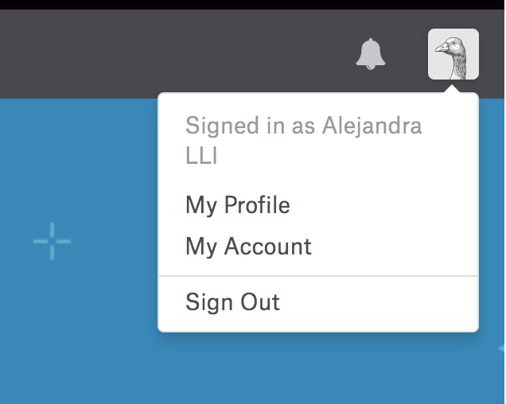
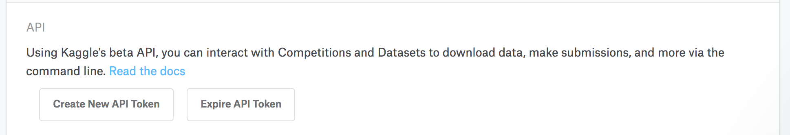

```{r, eval=TRUE, include=FALSE}
t<-Sys.time()
```

```{r setup, include=FALSE, message=FALSE}
knitr::opts_chunk$set(echo = TRUE)
library(tidyverse)
library(DT)
library(scales)
```

```{r Utils, message=FALSE, warning=FALSE}
source('02_Utils.R')
```

# Entendimiento de los datos. 

## Recolección de los datos iniciales

La recolección de los datos iniciales se realiza directamente desde la terminal. Para ello es necesario realizar los siguientes pasos: 

1. Asegurarse de que se tiene una versión de python 3 o superior. De no ser así, actualizar python (por ejemplo, se pueden seguir las instrucciones en https://docs.python-guide.org/starting/install3/osx/). 

2. Acceder a su cuenta de Kaggle. De no tener una, es necesario registrarse en https://www.kaggle.com/. 

3. Una vez que se accedió a la cuenta, ingresar a la sección **"My Account"**

    {width=300px}

4. Obtener un token en formato .json en la sección **API** seleccionando el boton **"Create New API Token"**. Guardar este token en la carpeta de **"Downloads"** del directorio raíz. 


4. Correr el archivo **DescargaDatos.sh** en la terminal. Este archivo:

    1. Installa la API de Kaggle. 
    
    2. Crea el directorio **.kaggle** en la raíz. 
    
    3. Transfiere el token a la carpeta del paso anterior. 
    
    4. Crea la carpeta **Proyecto_Final** en dentro del directorio **Documents**. 
    
    5. Crea las carpetas **Datos**, **Datos_trad** y **Datos_clean** dentro del directorio del proyecto final. 
    
    6. Descarga los datos de la competencia *Predict Future Sales* en la carpeta **Datos**.  
    
    7. Descomprime los archivos con extensión **.gz**


## Descripción de los datos

Se obtuvieron datos históricos de las ventas diarias de la compañía "1C Company" (en adelante 1C únicamente). A continuación se describe cada uno de los sets de datos. 

1. **items.csv**. Contiene información suplementaria sobre los artículos de vendidos por 1C. Este archivo contiene 22,170 observaciones para 3 variables. Las variables que incluye son: 

    1. *item_name*: nombre del artículo (en ruso). 
    
    2. *item_id*: identificador único del artículo. 
    
    3. *item_category_id*: identificador único de la categoría a la que pertenece el artículo.
    
    
2. **item_categories.csv**. Contiene información suplementaria sobre las categorías de los artículos vendidos por 1C. Este archivo contiene 84 observaciones  para 2 variables. Las variables que incluye son: 

    1. *item_category_name*: nombre de la categoría (en ruso). 
    
    2. *item_cateogry_id*: identificador único de la categoría.
    
3. **shops.csv**. Contiene información suplementaria sobre las tiendas de 1C. Este archivo contiene 60 observaciones para 2 variables. Las variables que incluye son: 

    1. *shop_name*: nombre de la tienda (en ruso).
    
    2. *shop_id*: identificador único de las tiendas de 1C. 
    

4. **sales_train.csv**. Contiene los datos de entrenamiento para el proyecto. Este archivo contiene 1,048,575 de observaciones para 6 variables. Las variables que incluye son: 

    1. *date*: fecha en que se registró la compra/devolución en el formato dd/mm/yyyy. 
    
    2. *date_block_num*: número consecutivo para el mes de venta. Es decir, enero 2013 es igual a 0, febrero 2013 es igual a 1, ..., octubre 2015 es igual a 33. 
    
    3. *shop_id*: identificador único de las tiendas de 1C en que se vendió/devolvió el artículo.
    
    4. *item_id*: identificador único del artículo de 1C que se vendió/devolvió. 
    
    5. *item_price*: precio en el que se vendió el artículo. No se menciona la moneda en que realizó la transacción, posiblemente fueron dólares o rublos rusos. 
    
    6. *item_cnt_day*: número de unidades vendidas del artículo. Números negativos indican una devolución del artículo. Se va a predecir una cantidad mensual de esta medida. 
    
    
5. **test.csv**. Contiene los datos de las tiendas y artículos para los cuales se tiene que predecir las ventas mensuales. Este archivo contiene 214,200 observaciones para 3 variables. Las variables que incluye son: 

    1. *ID*: identificador único para la dupla (tienda,artículo). 
    
    2. *shop_id*: identificador único de la tienda. 
    
    3. *item_id*: identificador único del artículo. 


6. **sample_submission_csv**. Contiene la muestra de la forma en que se deben ingresar las predicciones en el concurso. Contiene 214,200 observaciones para 2 variables. Las variables que incluye son: 

    1. *ID*: identificador único para la dupla (tienda,artículo). 
    
    2. *item_cnt_month*: predicción mensual del artículo en la tienda representada por ID. 
    
    
## Exploración de los datos

Para poder realizar una exploración de los datos, primero es necesario convertir los campos en ruso a un idioma que podamos entender. Elegimos la traducción al inglés para tratar de ganar la mayor precisión posible. 

### Traducción del ruso al inglés

Para la traducción de los catálogos del ruso al inglés se utilizó la librería translateR de R y la API de Google Translate. Los datos traducidos se almacenaron en el objeto **transdata.RData**. Dentro de este objeto se encuentran los siguientes data_frames: 

1. **item_category_ru**: corresponde al archivo **item_category.csv** original. Es decir, con el nombre de las categorías sólo en ruso. 

2. **item_category_en**: correpsonde al archivo **item_category.csv** con los nombres de las categorías tanto en ruso como en inglés. 

3. **item_category**: corresponde al archivo **item_category.csv** con los nombres de las categorías únicamente en inglés. 

4. **items_ru**: corresponde al archivo **items.csv** original. Es decir, con el nombre de los artículos sólo en ruso. 

5. **items_en**: correpsonde al archivo **items.csv** con los nombres de los artículos tanto en ruso como en inglés. 

6. **items**: corresponde al archivo **items.csv** con los nombres de los artículos únicamente en inglés.

7. **shops_ru**: corresponde al archivo **shops.csv** original. Es decir, con el nombre de las tiendas sólo en ruso. 

8. **shops_en**: correpsonde al archivo **shops.csv** con los nombres de las tiendas tanto en ruso como en inglés. 

9. **shops**: corresponde al archivo **shops.csv** con los nombres de las tiendas únicamente en inglés.


El proceso para la traducción de los catálogos se puede encontrar en el archivo **Traduccion.Rmd**. Cabe destacar que para poder utilizar la API de Google Translate es necesario generar una llave y esto puede ocasionar costos, por lo que se decide no incluir la llave en el archivo. Si desea realizar la traducción para nuevos datos, es necesario reemplazar el caracter *"Please_use_your_own_API_key"* del archivo **Traduccion.Rmd** por una llave válida de Google Translate.

Para generar una llave de la API de Google Translate, se requieren los siguientes pasos: 

1. <span style="color:red">PEDIR A JOSE CARLOS QUE ME DIGA QUÉ PASOS REALIZÓ Y TERMINAR DE EDITAR EL ARCHIVO Traduccion.Rmd. </span>


### Cargar catálogos y datos entrenamiento

```{r CargarDatos, warning=FALSE, message=FALSE}
# Cargamos catálogos traducidos
load('datos_trad/transdata.RData')


# Eliminamos los catalogos en ruso, así como los de ruso e inglés para que no ocupen memoria. 
rm(item_category_en,item_category_ru,items_en,items_ru,shops_en,shops_ru)


# Cargamos los datos de entrenamiento y prueba. Estos no contienen campos en ruso. 
train<-read_csv("datos/sales_train.csv")
test<-read_csv("datos/test.csv")

```

### Catálogo de artículos y categorías

El catálogo de artículos y de categorías se pueden juntar. Se hace un left join de éstos y se almacena en el data_frame **datos_items**. 

```{r JoinItemsCat}
# Unimos items y item_category con la variable item_category_id. 
datos_items<-left_join(items,item_category,by="item_category_id")%>%
  select(item_id, item_name, item_category_id, item_category_name)


# Guardamos como objeto Rds 
saveRDS(datos_items,"Datos_trad/datos_items.rds")
```

Hechamos un vistazo a los datos. Los identificadores se leen con variables enteras y los nombres de los artículos y las categorías como caracteres. Por lo tanto, no hay que reasignar tipos de variables por el momento. 

```{r}
glimpse(datos_items)
```

Verificamos que existan 22,170 artículos distintos y 84 categorías distintas como se observó en la descripción de los datos. 

```{r NoArts}

# No. de artículos distintos de acuerdo con el item_id
nrow(datos_items %>% select(item_id) %>% unique())

```

```{r NoNombreArts}

# No. de artículos distintos de acuerdo con el item_name
nrow(datos_items %>% select(item_name) %>% unique())

# No de nombres de artículos repetidos 
length(datos_items$item_name[which(duplicated(datos_items%>%select(item_name)))])
```

Utilizando el identificador de artículo se verficia que se cuenta con 22,170 artículos distintos. Sin embargo, cabe destacar que se tienen 27 nombres de artículos repetidos, esto puede deberse a imprecisiones en la traducción. Durante el proceso de estimación será indispensable utilizar el identificador del artículo y no el nombre. 

```{r NoCategorias}

# No. de cateogrías distintas. 
nrow(datos_items %>% select(item_category_name) %>% unique())

```


Obtenemos el número de artículos que pertenecen a cada categoría y los ordenamos de mayor a menor. 

```{r Prod_por_Cat, message=FALSE, warning=FALSE}
productos_por_categoria <- datos_items %>%
  group_by(item_category_id) %>%
  summarise(conteo = n())%>%
  left_join(item_category,key='item_category_name') %>%
  select(item_category_id,item_category_name,conteo)%>%
  arrange(desc(conteo))

productos_por_categoria_table<-productos_por_categoria
names(productos_por_categoria_table)<-c('Cat_Id','Categoria','No. Articulos')
datatable(productos_por_categoria_table)
```

Se tiene que las categorías con mayor número de artículos son Cinema-DVD, Music- Local Production CD, Cinema-Blu-ray, PC Games-Digital y Music-Vinyl; es decir, categorías relacionadas con la división de entretenimiento de la empresa. 


Las categorías con menor número de artículos son Service, Books-Cognitive Literature, Game Consoles - PS2, Books- Postcards y Accesories -PS2; es decir, aquellos artículos relacionados con la división de educación y con el PS2.  <span style="color:red"> Alguna buena justificación/idea de lo del PS2?? </span>


Las siguientes gráficas muestran el top10 y bottom10 de categrías por el número de artículos que contienen. 

```{r BarPlotTop}

top10<-productos_por_categoria%>%
  top_n(10)

ggplot(top10,aes(x = factor(item_category_id,top10$item_category_id[1:10]), y = conteo)) +
    geom_bar(stat = "identity")+
  theme(axis.text.x=element_text(angle=90))+
  ggtitle('Top 10 de categorias por numero de elementos')+
  xlab('Categoria')+
  ylab('No. de articulos')+
  scale_x_discrete(labels=top10$item_category_name)

```

La lista de las 10 categorías con mayor número de artículos de la tienda son:

```{r BarPlotBottom}

bottom10<-productos_por_categoria%>%
  top_n(-10)

ggplot(bottom10,aes(x = factor(item_category_id,bottom10$item_category_id[1:10]), y = conteo))+
    geom_bar(stat = "identity")+
  theme(axis.text.x=element_text(angle=90))+
  ggtitle('Bottom 10 de categorias por numero de elementos en cada categoria')+
  xlab('Categoria')+
  ylab('No. de articulos')+
  scale_x_discrete(labels=bottom10$item_category_name)


```


### Catalogo de tiendas

Hechamos un vistazo a los datos.
```{r}
glimpse(shops)

# Guardamos como objeto Rds 
saveRDS(shops,"Datos_trad/shops.rds")
```

Verificamos que el catálogo tenga las 60 tiendas que se describen en los datos.

```{r NoTiendas}
nrow(shops %>% select(shop_name) %>% unique())
```


### Datos de entrenamiento

Hechamos un vistazo a los datos de entrenamiento. 

```{r}
glimpse(train)
```

Vemos que algunas varaibles no están siendo reconocidas con el tipo correcto y faltan los nombres de los artículos, de las tiendas y de las categorías. Además, se requiere un identificador único para la dupla (tienda, artículo). 


Primero generamos el identificador de la dupla. Este será almacenado en la variable ID. 
```{r Duplas}

# Posibles combinaciones (tienda,art.)
duplas<-list(shop_id=unique(shops$shop_id),
             item_id=unique(datos_items$item_id))%>%
  expand.grid

# Se agrega el identificador. 
duplas<-duplas%>%
  mutate(ID=1:nrow(duplas))%>%
  select(ID,everything())
```

Ahora, hacemos el left join de los datos de entrenamiento con el catálogo de artículos y con el de tiendas. Análogamente hacemos un left join con el ID de la dupla (tienda,artículo)

```{r JoinTrainCatalogos,warning=FALSE, message=FALSE}

# Se unen las distintas tablas 
datos_train<-left_join(train,datos_items,by='item_id')%>%
  left_join(shops,by='shop_id')%>%
  left_join(duplas,by=c('item_id','shop_id'))

# Se vuelve a leer el tipo de cada dato. 
readr::type_convert(datos_train)
```

Veamos cuantas duplas distintas tenemos en el set de entrenamiento. 
```{r NoDuplas}
length(unique(datos_train$ID))
```


Se tienen 424,124 duplas en el set de entrenamiento de las 1,330,200 posibles. 

# Almacenamiento de los datos 

Almacenamos la base de datos en **Datos_trad/train_trad.rds**. 

```{r SaveTradData}
# Guardamos como objeto Rds 
saveRDS(datos_train,"Datos_trad/train_trad.rds")
```

# EDA

METER EL EDA AQUI... 


```{r, eval=TRUE, include=FALSE, results='hide'}
t<-t-Sys.time()

t
```