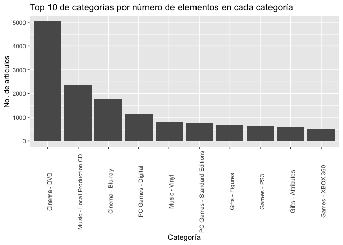
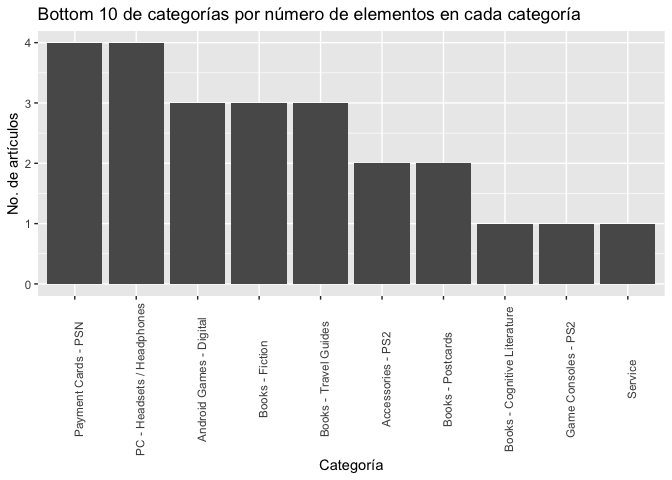

Análisis Exploratorio de Datos
================

Cargar catalogos y datos entrenamiento
======================================

``` r
items <- read_csv("datos/items.csv")
```

    ## Parsed with column specification:
    ## cols(
    ##   item_name = col_character(),
    ##   item_id = col_integer(),
    ##   item_category_id = col_integer()
    ## )

``` r
item_cat<-read_csv("datos/item_categories.csv")
```

    ## Parsed with column specification:
    ## cols(
    ##   item_category_name = col_character(),
    ##   item_category_id = col_integer()
    ## )

``` r
shops<-read_csv("datos/shops.csv")
```

    ## Parsed with column specification:
    ## cols(
    ##   shop_name = col_character(),
    ##   shop_id = col_integer()
    ## )

``` r
train<-read_csv("datos/sales_train.csv")
```

    ## Parsed with column specification:
    ## cols(
    ##   date = col_character(),
    ##   date_block_num = col_integer(),
    ##   shop_id = col_integer(),
    ##   item_id = col_integer(),
    ##   item_price = col_double(),
    ##   item_cnt_day = col_double()
    ## )

``` r
test<-read_csv("datos/test.csv")
```

    ## Parsed with column specification:
    ## cols(
    ##   ID = col_integer(),
    ##   shop_id = col_integer(),
    ##   item_id = col_integer()
    ## )

Catalogo Artículos
==================

Se hace un left join de los catalogos de item y item\_category.

``` r
datos_items<-left_join(items,item_cat,by="item_category_id")%>%
  select(item_id, item_name, item_category_id, item_category_name)
```

Hechamos un vistazo a los datos.

``` r
glimpse(datos_items)
```

    ## Observations: 22,170
    ## Variables: 4
    ## $ item_id            <int> 0, 1, 2, 3, 4, 5, 6, 7, 8, 9, 10, 11, 12, 1...
    ## $ item_name          <chr> "! ВО ВЛАСТИ НАВАЖДЕНИЯ (ПЛАСТ.)         D"...
    ## $ item_category_id   <int> 40, 76, 40, 40, 40, 40, 40, 40, 40, 40, 40,...
    ## $ item_category_name <chr> "Кино - DVD", "Программы - Для дома и офиса...

El catálogo de items tiene 22,170 renglones que equivalen a los distintos artículos que tiene la tienda.

``` r
datos_items %>% select(item_name) %>% unique()
```

    ## # A tibble: 22,170 x 1
    ##    item_name                                                           
    ##    <chr>                                                               
    ##  1 ! ВО ВЛАСТИ НАВАЖДЕНИЯ (ПЛАСТ.)         D                           
    ##  2 !ABBYY FineReader 12 Professional Edition Full [PC, Цифровая версия]
    ##  3 ***В ЛУЧАХ СЛАВЫ   (UNV)                    D                       
    ##  4 ***ГОЛУБАЯ ВОЛНА  (Univ)                      D                     
    ##  5 ***КОРОБКА (СТЕКЛО)                       D                         
    ##  6 ***НОВЫЕ АМЕРИКАНСКИЕ ГРАФФИТИ  (UNI)             D                 
    ##  7 ***УДАР ПО ВОРОТАМ (UNI)               D                            
    ##  8 ***УДАР ПО ВОРОТАМ-2 (UNI)               D                          
    ##  9 ***ЧАЙ С МУССОЛИНИ                     D                            
    ## 10 ***ШУГАРЛЭНДСКИЙ ЭКСПРЕСС (UNI)             D                       
    ## # ... with 22,160 more rows

En la tienda existen 84 categorías de artículos.

``` r
datos_items %>% select(item_category_name) %>% unique()
```

    ## # A tibble: 84 x 1
    ##    item_category_name                  
    ##    <chr>                               
    ##  1 Кино - DVD                          
    ##  2 Программы - Для дома и офиса (Цифра)
    ##  3 Музыка - CD локального производства 
    ##  4 Игры - PS3                          
    ##  5 Игры PC - Стандартные издания       
    ##  6 Игры - XBOX 360                     
    ##  7 Кино - Blu-Ray                      
    ##  8 Кино - Коллекционное                
    ##  9 Музыка - MP3                        
    ## 10 Книги - Аудиокниги                  
    ## # ... with 74 more rows

Obtenemos el número de artículos en cada categoría

``` r
productos_por_categoria <- datos_items %>%
  group_by(item_category_name) %>%
  summarise(conteo = n()) %>%
  arrange(desc(conteo)) 
```

La lista de las 10 categorías con mayor número de artículos de la tienda son:

``` r
productos_por_categoria%>%
  top_n(10)%>%
  ggplot(aes(x = factor(item_category_name,c(productos_por_categoria$item_category_name[1:10])), y = conteo)) + 
    geom_bar(stat = "identity")+
  theme(axis.text.x=element_text(angle=90))+
  ggtitle('Top 10 de categorías por número de elementos en cada categoría')+
  xlab('Categoría')+
  ylab('No. de artículos')
```

    ## Selecting by conteo



La lista de las 10 categorías con mayor número de artículos de la tienda son:

``` r
productos_por_categoria%>%
  top_n(-10)%>%
  ggplot(aes(x = factor(item_category_name,c(productos_por_categoria$item_category_name[(nrow(productos_por_categoria)-10):nrow(productos_por_categoria)])), y = conteo)) + 
    geom_bar(stat = "identity")+
  theme(axis.text.x=element_text(angle=90))+
  ggtitle('Bottom 10 de categorías por número de elementos en cada categoría')+
  xlab('Categoría')+
  ylab('No. de artículos')
```

    ## Selecting by conteo



Catalogo Tiendas
================

Hechamos un vistazo a los datos.

``` r
glimpse(shops)
```

    ## Observations: 60
    ## Variables: 2
    ## $ shop_name <chr> "!Якутск Орджоникидзе, 56 фран", "!Якутск ТЦ \"Центр...
    ## $ shop_id   <int> 0, 1, 2, 3, 4, 5, 6, 7, 8, 9, 10, 11, 12, 13, 14, 15...

El catálogo de tiene 60 tiendas distintas.

``` r
shops %>% select(shop_name) %>% unique()
```

    ## # A tibble: 60 x 1
    ##    shop_name                         
    ##    <chr>                             
    ##  1 !Якутск Орджоникидзе, 56 фран     
    ##  2 "!Якутск ТЦ \"Центральный\" фран" 
    ##  3 "Адыгея ТЦ \"Мега\""              
    ##  4 "Балашиха ТРК \"Октябрь-Киномир\""
    ##  5 "Волжский ТЦ \"Волга Молл\""      
    ##  6 "Вологда ТРЦ \"Мармелад\""        
    ##  7 Воронеж (Плехановская, 13)        
    ##  8 "Воронеж ТРЦ \"Максимир\""        
    ##  9 "Воронеж ТРЦ Сити-Парк \"Град\""  
    ## 10 Выездная Торговля                 
    ## # ... with 50 more rows

Datos de entrenamiento
======================

``` r
glimpse(train)
```

    ## Observations: 2,935,849
    ## Variables: 6
    ## $ date           <chr> "02.01.2013", "03.01.2013", "05.01.2013", "06.0...
    ## $ date_block_num <int> 0, 0, 0, 0, 0, 0, 0, 0, 0, 0, 0, 0, 0, 0, 0, 0,...
    ## $ shop_id        <int> 59, 25, 25, 25, 25, 25, 25, 25, 25, 25, 25, 25,...
    ## $ item_id        <int> 22154, 2552, 2552, 2554, 2555, 2564, 2565, 2572...
    ## $ item_price     <dbl> 999.00, 899.00, 899.00, 1709.05, 1099.00, 349.0...
    ## $ item_cnt_day   <dbl> 1, 1, -1, 1, 1, 1, 1, 1, 1, 3, 2, 1, 1, 2, 1, 2...

Generamos un ID para la dupla (art,tienda)

``` r
duplas<-list(item_id=unique(datos_items$item_id),
             shop_id=unique(shops$shop_id))%>%
  expand.grid

duplas<-duplas%>%
  mutate(ID=1:nrow(duplas))%>%
  select(ID,everything())
```

Hacemos el left join de los datos de entrenamiento con el catalogo de artículos y de tiendas. También hacemos un left join con el ID de la dupla (artículo,tienda)

``` r
datos_train<-left_join(train,datos_items,by='item_id')%>%
  left_join(shops,by='shop_id')%>%
  left_join(duplas,by=c('item_id','shop_id'))
```

``` r
str(datos_train)
```

    ## Classes 'tbl_df', 'tbl' and 'data.frame':    2935849 obs. of  11 variables:
    ##  $ date              : chr  "02.01.2013" "03.01.2013" "05.01.2013" "06.01.2013" ...
    ##  $ date_block_num    : int  0 0 0 0 0 0 0 0 0 0 ...
    ##  $ shop_id           : int  59 25 25 25 25 25 25 25 25 25 ...
    ##  $ item_id           : int  22154 2552 2552 2554 2555 2564 2565 2572 2572 2573 ...
    ##  $ item_price        : num  999 899 899 1709 1099 ...
    ##  $ item_cnt_day      : num  1 1 -1 1 1 1 1 1 1 3 ...
    ##  $ item_name         : chr  "ЯВЛЕНИЕ 2012 (BD)" "DEEP PURPLE  The House Of Blue Light  LP" "DEEP PURPLE  The House Of Blue Light  LP" "DEEP PURPLE  Who Do You Think We Are  LP" ...
    ##  $ item_category_id  : int  37 58 58 58 56 59 56 55 55 55 ...
    ##  $ item_category_name: chr  "Кино - Blu-Ray" "Музыка - Винил" "Музыка - Винил" "Музыка - Винил" ...
    ##  $ shop_name         : chr  "Ярославль ТЦ \"Альтаир\"" "Москва ТРК \"Атриум\"" "Москва ТРК \"Атриум\"" "Москва ТРК \"Атриум\"" ...
    ##  $ ID                : int  1330185 556803 556803 556805 556806 556815 556816 556823 556823 556824 ...

Se tienen 424124 duplas (art., tienda) en el set de entrenamiento de las 1,330,200.

``` r
length(unique(datos_train$ID))
```

    ## [1] 424124

Arreglamos la fecha
===================

``` r
datos_train<-datos_train%>%
  mutate(day=as.numeric(substring(date,1,2)),
         month=as.numeric(substring(date,4,5)),
         year=as.numeric(substring(date,7)),
         date=as.Date(date,format="%d.%m.%Y"))%>%
  select(date,day,month,year,everything())
```
